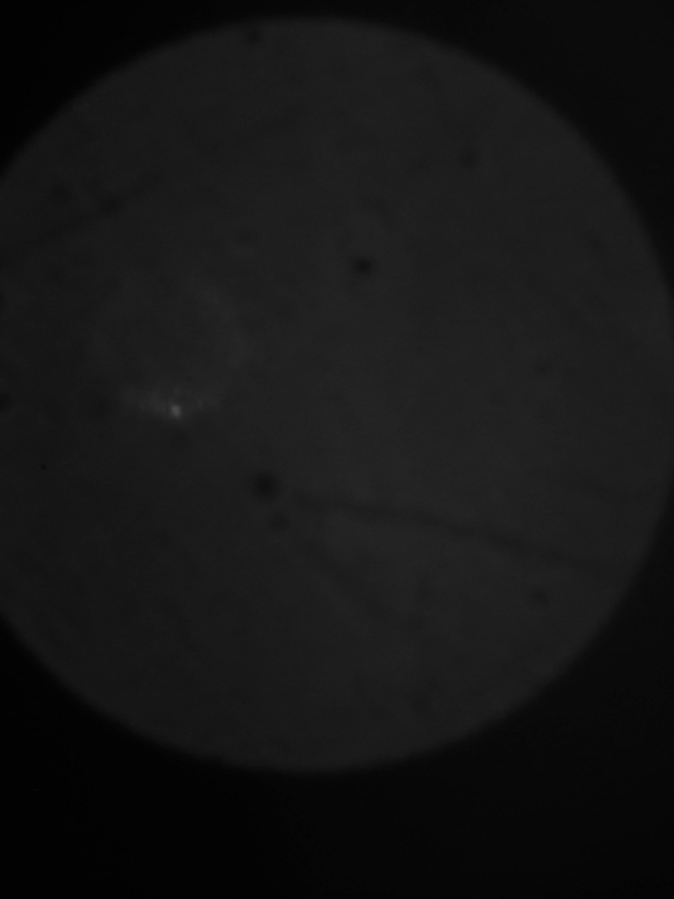

# miniSPIM
An attempt to democratize light-sheet microscopy. 


This is the repository for the open-source low-cost light-sheet microscope based on a monochromatic cellphone CMOS sensor and commercially available laser-scanning video projector.

<p align="center">

</p>


Disucssion can also be found in [Twitter](https://twitter.com/beniroquai/status/1185129736726560768)

Everything on your own risk, no guarantees that it works or that it harms you! It's just a fun project without any professional use in mind! 

## Motivation

*  Low price (<500€) 
*  Portable
*  Small footprint
*  ready for the incubator 
*  Isotropic resolution of about 3µm 
*  Excitation Wavelength: 450, 530, 605nm 
*  Mechanical X/Y-Stage for coarse sample movevement 
*  Electrical X/Y-Stage for fine through-focus series of the sample 

## Setup

### Optical Setup

The 
<p align="center">

</p>


### Remove the lens of the Huawei P9 (at your own risk!!)

In this setup, we had to remove the lens to have bare accessoto the Sony IMX286 monochromatic chip. A minimum set of tools was necessary. A brief description with pictures is shown below

#### Open the cellphone
<p align="center">

</p>

#### Get out the camera module
<p align="center">

</p>

#### Get out the camera module II
<p align="center">

</p>

#### Get rid of the left (!) lens module - take a knife to remove the soldering gently (!)
<p align="center">

</p>


#### Get rid of the lens module 
<p align="center">

</p>

#### Put the lens module back into the cellphone
<p align="center">

</p>

#### Hope that everything went well!
<p align="center">

</p>


### Mechanical Setup

The Setup is relatively simple to assemble. A base-plate holds the Projector, the lenses (CCTV as objective and 25mm lens as illumination objective) as well as the mirror. The lid holds everything in place and the smartphone adapter keeps the cellphone in the correct distance from the CCTV lens.

#### Sample mount 

One can use asimple syrringe for to prepare a sample e.g. in agarose. To reduce scattering, we provide a simple sample chaber which an be filled with water. The tip of the agarose can be put inside the water. 

### Electronic setup

For the wiring of the two bipolar motors from the low-cost XY-stage, we used an Arduino Nano equipped with two H-bridges directly connected to the motor. 

The following gives you a very brief introduction of the workin principle of the low-cost, but very precise Z-stage which is used in our setups. You can find a more detailed version of the description at [aliexpress](https://aliexpress.com/item/Micro-stepping-motor-cross-platform-small-mobile-digital-microscope-XY-axis-table-experiment-two-slide/32790147861.html) (chineses though). 
I have absolutely no clue where this piece is actually coming from, but it is working really great! 

It is equipped with two bipolar stepper motors for X and Y direction. The wiring follows (from left to right):

	1 -- A+	
	2 -- B+	
	3 -- A-	
	4 -- B-
	


It can be controlled with an ESP32 or Arduino for example. Code is very easy as it relies on the $stepper.h$ library in Arduion IDE. We tested seveal H-Bridges to amplify the current coming from the Arduino GPIOs. The L293m works fine, but the DRV8833 is also good and even much smaller. The complete tutorial for can also be found at [Adafruit](https://learn.adafruit.com/adafruit-drv8833-dc-stepper-motor-driver-breakout-board/stepper-motor-usage). 

The motor can be connected as follows:


If one uses an H-Bridge one simply need to make sure, that A+/A- and B+/B- are connected to MOTOR A and MOTOR B respectively. 

#### Properties
	- Impedance: ~45 ohm
	- Stepsize: 18 degree
	- Voltage: 5 V
	- Peak Current: 100mA 
	- Movement X/Y: 2.4 mm

	
### Code 
The code is from the Adafruit example with the wiring explained above:

	#include <Stepper.h>
 
	// change this to the number of steps on your motor
	#define STEPS 200
	 
	// create an instance of the stepper class, specifying
	// the number of steps of the motor and the pins it's
	// attached to
	Stepper stepper(STEPS, 4, 5, 6, 7);
	 
	 
	void setup()
	{
	  Serial.begin(9600);
	  Serial.println("Stepper test!");
	  // set the speed of the motor to 30 RPMs
	  stepper.setSpeed(60);
	}
	 
	void loop()
	{
	  Serial.println("Forward");
	  stepper.step(STEPS);
	  Serial.println("Backward");
	  stepper.step(-STEPS);
	}
	
	
### NOTES
Make sure you're releasing the Motor after usage, otherwise it can get quiet hot!


## Experiments

In order to perform an experiment one need to do the following steps:

* Generate the light-sheet pattern using a computer by displaying a single-pixel line on a full-screen image (e.g. black screen, blue line (RGB=0,0,255))
* Eventually move the line periodically to find the best position of the light sheet (use the PPT in the presentation folder) 
* Align the smartphone, so that the round-circle is in the center of the CMOS camera sensor (therefore take a light-source and shine light inside the smaple chamber, i.e. inline with the CCTV lens)
* Insert the syringe in the sample holder
* Move the X/Y move so that the sample is in focus by placing a light source perpendicular to the light-sheet or in-line with the detection objective 
* Let the electric X/Y stage oscillate back and forth to acquire a through-focus series 
* Acquire a video sequence of the sample


## Parts 

### 3D printed parts 
All files can be found in the folder [STL](./STL). 

* 1x [Base Plate](./STL/0_MiniSPIM_Base_v1.stl)
* 1x [Sample Chamber](./STL/10_MiniSPIM_Samplechamber.stl)
* 1x [Space for Smartphone](./STL/10_MiniSPIM_Smarthponebase.stl)
* 1x [Lid for the Baseplate](./STL/10_MiniSPIM_Lid.stl)
* 1x [Adapter for the XY-Stage: Arm which holds the syrringe](./STL/10_MiniSPIM_XY_Stageplate.stl)
* 1x [Adapter for the XY-Stage: Arm which holds the electronic XY-stage](./STL/10_MiniSPIM_XY_Stageplate.stl)

### Bill of materials

(Links to the shops are not sponsored!)

* 1x cellphone (Huawei P9, remove the lens from the monochromatic camera) - ***150€***
* 1x XY-Stage (60x60xmm range) - ***60€***
* 1x motorized XY-Stage ([aliexpress](https://aliexpress.com/item/Micro-stepping-motor-cross-platform-small-mobile-digital-microscope-XY-axis-table-experiment-two-slide/32790147861.html) ) - ***3€***
* 1x ESP32 - ***5€***
* Set of M3 screws - ***1€***
* 3x Coverglass, 18x18mm - ***1€***
* 1x Laser-scanning projector, SONY MP-CL1A [Link to Sony](https://www.sony.com/electronics/projector/mp-cl1a) - ***250€***
* Filterset ***1€***
* Wires, USB-Cable, HDMI-Cable - ***15€***
* Comar Mirror d=10mm - ***20€***
* 1x CCTV Lens (f=4mm, f#=1.8) - ***10€***
* 1x 25mm lens, diameter: 15mm

## Results

### Acquisition using the cellphone 

The Huawei P9 does not allow the acquisition of monochromatic videos by default. Therefore we used the open-source app ***FreeDCam*** available from [github](https://github.com/KillerInk/FreeDcam/tree/cellstorm) or the playstore. In order to reduce the bouncing effect caused by intereference of the scan-speed of the laser (60 Hz), one need to select a frame-rate t_exp < 1/60 s respectively. ISO settings should be selected to get enough signal (usally 1000-2000) for high-quality samples. 

### Use MP4 in Fiji 

Since Fiji does not accept ```.mp4```-files by default, one need to transcode the video into a sequence of images which can be imported through Fiji. This can conveniently be done by using ```ffmpeg``` (freely available from Windows, MAC and Linux!). A standard command to extract the frames into a folder is the following: 

```ffmpeg -i MOV_2019_10_24_07_33_13.mp4 -filter:v "crop=1024:1024:512:512" -vsync 0  MOV_2019_10_24_07_33_13/cropped%06d.png```


### Lens-tissue Focus-Sweep

Here a lens-tissue "labelled" with fluorescent marker (Stabilo, Fluorescent Yellow) was swept through the focus. A theater filter blocks the light of the blue exciting laser. 

<p align="center">

</p>

A 3D projection of the result in ClearVolume looks like this: 
<p align="center">

</p>

### Bright-field and light-sheet mode of Pollen

<p align="center">

</p>

<p align="center">

</p>

Better images are coming soon! 


## License
Hardware follows the CERN license. Everything else is licensed under CC-BY-NC. 

Everything is free to use - but we would like to ask you for any suggestions and comments. This makes sure, that we can improve this project. 

Everything was developed in the [@Heintzmann-Lab](www.nanoimaging.de) around Rainer Heintzmann at the IPHT Jena. 

## Contribution

We need proper samples! If you know how to prepare easy to use cleared fluorescent samples ready for the SPIM, please contact us!! :) 

In case you have any questions, please fiel an issue or write us an email. We try to improve the setup. 

There is high potential to automate everything - if you have time and want to do that: We hire (but don't have any money - sorry ;-) 
